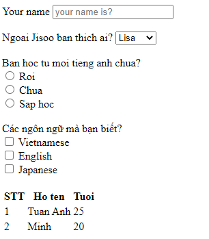
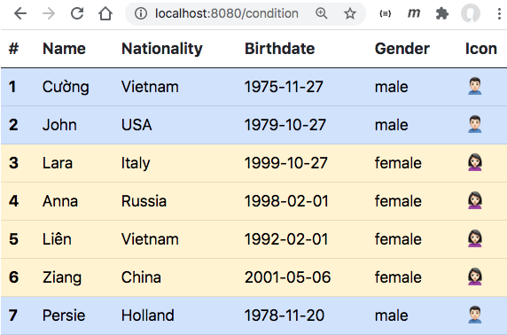
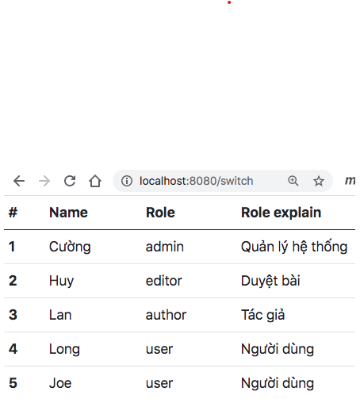
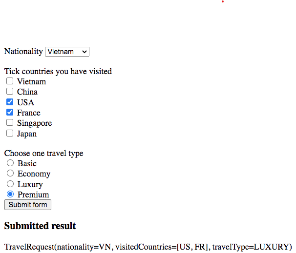

# Server Side Rendering vs Client Side Rendering
Server Side Rendering là một thuật ngữ để chỉ web server sẽ sinh ra mã HTML rồi trả về cho trình duyệt. Response content type sẽ là “text/html”
Ưu điểm của Server Side Rendering là:

- Lập trình web back end lập trình luôn cả giao diện. Sửa đổi gì cũng nhanh gọn, tức thì.
- Có thể caching toàn bộ cả trang web để tăng tốc
- Search Engine Optimization tốt hơn
- Không yêu cầu trình duyệt mới nhất.
- Không cần phải học những thư viện front end kiểu như React, Vue, Angular
- Bảo mật dễ dàng hơn, dể kiểm soát quyền hơn
---
Nhược điểm của Server Side Rendering:

- Do trả về HTML nên không thân thiện với những ứng dụng di động (native mobile app) hay ứng dụng IOT
- Đôi khi tốn nhiều network bandwith vì trả về mã HTML quá lớn.
- Khó lập trình những tương tác JavaScript giúp trải nghiệm người dùng tốt ví dụ như làm tươi lại một phần giao diện mà không cần tải lại trang web
---
Ngược lại Client Side Rendering thì nhiệm vụ sinh ra mã HTML sẽ ở phía trình duyệt.
Web server sẽ trả về dữ liệu kiểu JSON hoặc XML.
Ưu điểm của Client Side Rendering:

- Web Server chỉ tập trung xử lý logic back end, đọc ghi CSDL…
- Có thể kiểm thử độc lập front end và back end.
- Cùng một service API, có thể lập trình web client và mobile client kết nối vào.
---
Nhược điểm của Client Side Rendering là:

- Với những ứng dụng web giao diện đơn giản thì việc lập trình React.js, Angular hay Vue thường sẽ mất thời gian và yêu cầu lập trình viên có kỹ năng lập trình front end cao cấp hơn là viết mã HTML.
- Cần phải hosting ứng dụng Web Client Side.


# Mô hình Model - View - Controller
- Model: mô tả cấu trúc dữ liệu và cả dữ liệu từ client gửi lên và từ phía service hoặc database sẽ trả về cho client. Không bận tâm đến giao diện hay logic.
- View: chứa các khuôn mẫu giao diện (view template), khi kết hợp với dữ liệu sẽ tạo ra giao diện trả về cho người dùng.
- Controller: tiếp nhận các yêu cầu của client, xử lý logic, lấy dữ liệu từ service, database rồi trả về cho View.

# View Template Engine
Hầu hết các Web framework hiện nay đều hỗ trợ MVC vì MVC phổ biến, dễ hiểu, dễ lập trình. Trong phần View sẽ có 2 khái niệm:

- View Template: khuôn mẫu view, có dạng HTML kết hợp với cú pháp để nhúng, hiển thị dữ liệu. Cú pháp có thể là Handle Bar, Pug, Django syntax.
- View Template Engine: là thư viện thực hiện việc ghép dữ liệu và khuôn mẫu view.
---
Thymeleaf là một thư viện View Template Engine. Nó được dùng trong Spring Boot dưới dạng Maven hay Gradle Dependency.

```html
<dependency>
	<groupId>org.springframework.boot</groupId>
	<artifactId>spring-boot-starter-thymeleaf</artifactId>
</dependency>
```

# View Template Engine là gì và có những chức năng căn bản nào?

- Cho phép sử dụng 1 đến vài loại view template engine
- Trả về REST API
- Xử lý request theo đường dẫn, tham số, body và loại request (GET, POST, PUT, PATCH, DELETE) và trả về response
- Quản lý session.
- Gán và đọc cookie
- Tạo chuỗi thành phần trung gian để xử lý request ~ middle ware
- Xác thực (authentication) - phân quyền (authorization)
- Tích hợp các thư viện kết nối CSDL khác nhau, gửi nhận message…

# Form và table html
```html
<body>
    <!-- Điền thông tin vào form mẫu -->
    <form>
        <lable>Your name</lable>
        <input type="text" placeholder="your name is?">
    </form>
    <br>
    <!-- Chọn thông tin dạng thanh cuộn -->
    <lable>Ngoai Jisoo ban thich ai?</lable>
    <select>
        <option> Lisa</option>
        <option> Rose</option>
        <option> Jenny</option>
    </select>
    <br>
    <!-- Tích một lựa chọn -->
    <br>
    <label>Ban hoc tu moi tieng anh chua?</label><br>
    <input type="radio" name="learning english" /> Roi <br>
    <input type="radio" name="learning english" /> Chua<br>
    <input type="radio" name="learning english" /> Sap hoc<br>

    <!-- Tích nhiều lựa chọn -->
    <br>
    <label>Các ngôn ngữ mà bạn biết?</label><br>
    <input type="checkbox" name="learning english" /> Vietnamese <br>
    <input type="checkbox" name="learning english" /> English<br>
    <input type="checkbox" name="learning english" /> Japanese<br>

    <!-- Table -->
    <br>
    <table>
        <tr>
            <th>STT</th>
            <th>Ho ten</th>
            <th>Tuoi</th>
        </tr>
        <tr>
            <td>1</td>
            <td>Tuan Anh</td>
            <td>25</td>
        </tr>
        <tr>
            <td>2</td>
            <td>Minh</td>
            <td>20</td>
        </tr>
    </table>
</body>
```


# Thymeleaf

## 1. Các loại biểu thức

- ${...}: biểu thức thay giá trị của biến vào template
- *{...}: biểu thức thay thuộc tính của biến vào template. Hay dùng với form post
- #{...}: message expression, biểu thức thay chuỗi đa ngôn ngữ từ file resource.
- @{...}: link expression, biểu thức liên kết
- ~{...}: fragement expression, biểu thức mảnh

## 2. Các cú pháp 
- th:text đổ text thuần không thẻ HTML vào view template
- th:utext đổ text có thẻ HTML, CSS vào view template


Controller:
```java
@GetMapping("/text")
public String demoText(Model model) {
    Person tom = new Person("Tom", "USA", "1976-12-01", "male");
    model.addAttribute("person", tom);
    model.addAttribute("message", "<h2>Display <span style='color:red'>HTML</span> inside</h2>");
    return "text";
}
```
```html
HTML:
<div th:text="${person.name + ' : ' + person.nationality}"></div>
<div th:text="${person.name} + ' : ' + ${person.nationality}"></div>
<div th:text="|${person.name}  :  ${person.nationality}|"></div>
<div th:utext="${message}"></div>
<div th:text="${person}"></div>
```
- Link expression

Controller:
```java
@GetMapping("/link")
public String linkExpression(Model model) {
    model.addAttribute("dynamiclink", "products");
    return "link";
}
```
```html
HTML:
<a th:href="@{/about}">Abosolute Link</a><br>
<a th:href="@{~/topic/thymeleaf}">Relative link 1</a><br>
<a th:href="@{topic/thymeleaf}">Relative link 2</a><br>
<a th:href="@{/about(foo='bar',tom='jerry')}">Query string parameters</a><br>
<a th:href="|/${dynamiclink}|">dynamic link 1</a><br>
<a th:href="@{${dynamiclink}}">dynamic link 2</a><br>
<a th:href="@{/page/(id=${dynamiclink})}">dynamic link 3</a><br>
```
- th:fragment để định nghĩa một mảnh HTML cần tái sử dụng nhiều lần
- th:insert để chèn một mảnh HTML định nghĩa trước đó vào trong thẻ hiện tại
- th:replace để thay thế một mảnh HTML định nghĩa trước đó cho thẻ hiện tại

HTML: tại mục template.html
```html
<!DOCTYPE html>
<html lang="en">
<head th:fragment="header(title)">
  <meta charset="UTF-8">
  <meta name="viewport" content="width=device-width, initial-scale=1.0">
  <link href="https://cdn.jsdelivr.net/npm/bootstrap@5.0.2/dist/css/bootstrap.min.css" rel="stylesheet" integrity="sha384-EVSTQN3/azprG1Anm3QDgpJLIm9Nao0Yz1ztcQTwFspd3yD65VohhpuuCOmLASjC" crossorigin="anonymous">
  <script src="https://cdn.jsdelivr.net/npm/bootstrap@5.0.2/dist/js/bootstrap.bundle.min.js" integrity="sha384-MrcW6ZMFYlzcLA8Nl+NtUVF0sA7MsXsP1UyJoMp4YLEuNSfAP+JcXn/tWtIaxVXM" crossorigin="anonymous"></script>
  <title th:text="${title}"></title>
</head>
<body>
  <div th:fragment="topmenu">
    <ul class="nav">
      <li class="nav-item">
        <a class="nav-link" href="/">Home</a>
      </li>
      <li class="nav-item">
        <a class="nav-link" href="/products">Products</a>
      </li>
      <li class="nav-item">
        <a class="nav-link" href="/services">Services</a>
      </li>
      <li class="nav-item active">
        <a class="nav-link" aria-current="page" href="/about">About us</a>
      </li>
    </ul>
  </div>
  <div th:fragment="footer">
     <p>Written by Cuong, a bad web developer</p>
  </div>
</body>
</html>
```

HTML: tại mục about.html
```html
<!-- Tái sử dụng lại template html (header and footer) -->
<!DOCTYPE html>
<html lang="en">
<head th:replace="template.html :: header('about')">
</head>
<body>
  <header th:insert="template.html :: topmenu"> </header>
  <div class="container">
    <p>
      About us
    </p>
  </div>  
  <header th:replace="template.html :: footer"> </header>
</body>
</html>
```

- Điều kiện th:if, th:unless


```html
<td>
    <span th:if="${person.gender == 'female'}">🙎🏻‍♀️</span>
    <span th:unless="${person.gender == 'female'}">🙎🏻‍♂️</span>
</td>
```

- Switch th:switch và th:case


```html
<td th:switch="${user.role}">
    <span th:case="admin">Quản lý hệ thống</span>
    <span th:case="editor">Duyệt bài</span>
    <span th:case="author">Tác giả</span>
    <span th:case="user">Người dùng</span>
</td>
```

- Đổ dữ liệu List Box, Check Box, Radio Box


B1: Tạo thuộc tính dối tượng (model)
```java
@Data
@AllArgsConstructor
public class Country {
  private String name;
  private String code;
}
---------------------------
public enum TravelType {
  BASIC("Basic"),
  ECONOMY("Economy"),
  LUXURY("Luxury"),
  PREMIUM("Premium");

  private String value;

  TravelType(String value) {
    this.value = value;
  }

  public String getValue() {
    return value;
  }
}
```
B2: Tạo Data trong repository(repository)
```java
@Repository
public class InMemoryRepository {
private ArrayList<Country> countries;

public InMemoryRepository() {
    countries = new ArrayList<>(List.of(
      new Country("Vietnam", "VN"),
      new Country("China", "CN"),
      new Country("USA", "US"),
      new Country("France", "FR"),
      new Country("Singapore", "SG"),
      new Country("Japan", "JP")
      ));
}
public List<Country> getCountries() {
    return countries;
  }
}
```

B3: Tạo request(request)
```java
@Data
@AllArgsConstructor
public class TravelRequest {
  private String nationality;
  private List<String> visitedCountries;
  private TravelType travelType;
  public TravelRequest() {
    visitedCountries = new ArrayList<>();
    travelType = TravelType.BASIC;
  }
}
```
B4: Hứng request, đổ dữ liệu vào view template (Controller)
```java
@Controller
public class TravelController {
  @Autowired
  private InMemoryRepository repo;

  @GetMapping("/travel")
  public String showTravelForm(Model model) {
    model.addAttribute("countries", repo.getCountries());
    model.addAttribute("travelRequest", new TravelRequest());
    model.addAttribute("travelTypes", TravelType.values());
    return "travel";
  }

  @PostMapping("/travel")
  public String handleTravelPost(@ModelAttribute TravelRequest request, BindingResult bindingResult, Model model) {
    if (!bindingResult.hasErrors()) {
      System.out.println(request);
    }

    model.addAttribute("countries", repo.getCountries());
    model.addAttribute("travelTypes", TravelType.values());
    model.addAttribute("travelRequest", request);
    return "travel";
  }
}
```
- th:each -> để dyệt mảng
- th:text -> để hiển thị mô tả từng dòng của list box
- th:value -> thể hiện giá trị của dòng
- th:selected -> đánh dấu dòng nào được người dùng chọn.

Hiển thị List Box


```html
<label for="countries">Nationality</label>
<select name="nationality" id="nationality">
    <option
    th:each="country:${countries}"
    th:text="${country.name}"
    th:value="${country.code}"
    th:selected="${travelRequest.nationality==country.code}">China</option>
</select>
```
Hiển thị Check Box
```html
<label for="visitedCountries">Tick countries you have visited</label><br>
<span th:each="country:${countries}">
    <input type="checkbox" name="visitedCountries"
    th:value="${country.code}"
    th:checked="${#lists.contains(travelRequest.visitedCountries, country.code)}">
    <label th:text="${country.name}" for="visitedCountries"></label><br>
</span>
```

Hiển thị radio box
```html
<label for="travelType">Choose one travel type</label><br>
<span th:each="travel_type:${travelTypes}">
    <input type="radio" name="travelType"
    th:value="${travel_type}"
    th:checked="${travelRequest.travelType.value==travel_type.value}">
    <label th:text="${travel_type.value}" for="travelType"></label><br>
</span>
```
# Làm sao để chọn mục List Box, check ô Check Box, tick ô Radio Box khi hiển thị lại form?

- th:selected
- th:checked

Đối với List Box và Radio Box, lựa chọn chỉ có một, do đó chúng ta chỉ dùng hàm so sánh giá trị hiện tại của mục/ô có bằng giá trị thuộc tính bản ghi
```java
th:selected="${travelRequest.nationality==country.code}"
th:checked="${travelRequest.travelType.value==travel_type.value}">
```

Tuy nhiên với radio box, người dùng được phép chọn nhiều ô, do đó chúng ta phải dùng list utility function
```java
th:checked="${#lists.contains(travelRequest.visitedCountries, country.code)}"
```

# Hiển thị form và gửi form lên sever
- th:action viết biểu thức đường dẫn mà Form sẽ gửi lên server. Nó khác thuộc tính action vốn có của Form ở chỗ, bạn có thể viết biểu thức, biến, so sánh, điều kiện…để động hoá đường dẫn.
- th:object khai báo đối tượng chứa dữ liệu các trường để điền vào form.
- th:field lấy dữ liệu trong từng thuộc tính của đối tượng đổ vào một trường text.
---
Form để nhập dữ liệu phục vụ cho thao tác tạo mới (Create), sửa đổi (Edit), thậm chí cả xoá (Delete). Có 3 khả năng:
1. Trình duyệt gửi GET request yêu cầu hiển thị Form để tạo mới. Lúc này các giá trị các trường text trong form sẽ trắng, các trường List Box, Check Box, Radio Box có thể không chọn hoặc chọn giá trị mặc định. Chúng ta cần truyền đối tượng mô tả đầy đủ các trường dữ liệu của Form.

- Ví dụ tạo Form trống trong BMIController.java: model.addAttribute("bmiRequest", new BMIRequest());
```java
@GetMapping
public String getBMIForm(Model model) {
 model.addAttribute("bmiRequest", new BMIRequest());
 model.addAttribute("bmiResult", null);
 return "bmi";
}
```
2. Trình duyệt gửi GET request tạo Form nhưng lần này có thêm tham số ID của bản ghi, lấy dữ liệu đổ vào Form

3. Hứng POST request mà form gửi lên ở Controller

```html
<form action="#" th:action="@{/bmi}" th:object="${bmiRequest}" method="post">
    <input type="text" placeholder="Your name" th:field="*{name}"/><br><br>
    <input type="text" placeholder="Your email" th:field="*{email}"/><br><br>
    <input type="text" placeholder="Your height" th:field="*{height}"/> (m)<br><br>
    <input type="text" placeholder="Your weight" th:field="*{weight}"/> (kg)<br><br>
    <button type="submit">Calculate BMI</button>
</form>
```

4. Khi Form chứa các trường list box, radio box, check box, bạn cần tham khảo mục hướng dẫn đổ dữ liệu vào List box, check box, radio box phía trên. Với các custom component, chúng ta dùng th:text, th:value, th:each, th:class, th:classappend để điền dữ liệu, thay đổi class style.
---
Phương thức xử lý POST request ở server sẽ có dạng
```java
@PostMapping("/path")
public String handleForm(@ModelAttribute Request request, BindingResult bindingResult, Model model) {
    if (! bindingResult.hasErrors()) {
        //Logic xử lý nếu không có lỗi
        //Ghi hoặc cập nhật vào CSDL
    }
    model.addAttribute("key", formObject); //formObject có thể là chính request nếu chúng ta muốn hiển thị lại
    model.addAttribute("foo", valuesForListBox); //đổ dữ liệu vào Listbox
    model.addAttribute("bar", valuesForCheckBox); //đổ dữ liệu vào Checkbox
}
```

- th:block
Thông thường chúng ta sẽ viết cú pháp Thymeleaf dưới dạng các thuộc tính nhúng vào các thẻ HTML. Tuy nhiên có trường hợp th:block lại hành xử giống như một thẻ html. Nó hữu ích khi chúng ta muốn thực hiện logic loop, condition ở cấp độ thẻ HTML chứ không ở cấp độ thuộc tính trong thẻ. Ví dụ ở file thblock.html, nhờ có th:block, chúng ta đặt được điều khiển vòng lặp th:each và th:switch ra ngoài thẻ li code trong sáng hơn nhiều:
```html
<ul>
    <th:block th:each="travel_type : ${travelTypes}" th:switch="${travel_type.value}">
        <li th:case="Premium">
            <span th:text="${travel_type.value}">Premium</span>
            <input type="checkbox" name="Premium" th:value="jet"><label>Private Jet</label>
            <input type="checkbox" name="Premium" th:value="champaign"><label>Champaign</label>
        </li>
        <li th:case="Luxury">
            <span th:text="${travel_type.value}">Luxury</span>
            <input type="checkbox" name="Luxury" th:value="swimmingpool"><label>Swimming Pool</label>
            <input type="checkbox" name="Luxury" th:value="taxi"><label>Airport taxi</label>
        </li>
        <li th:case="*">
            <span th:text="${travel_type.value}">Other</span>
        </li>
    </th:block>
</ul>
```


